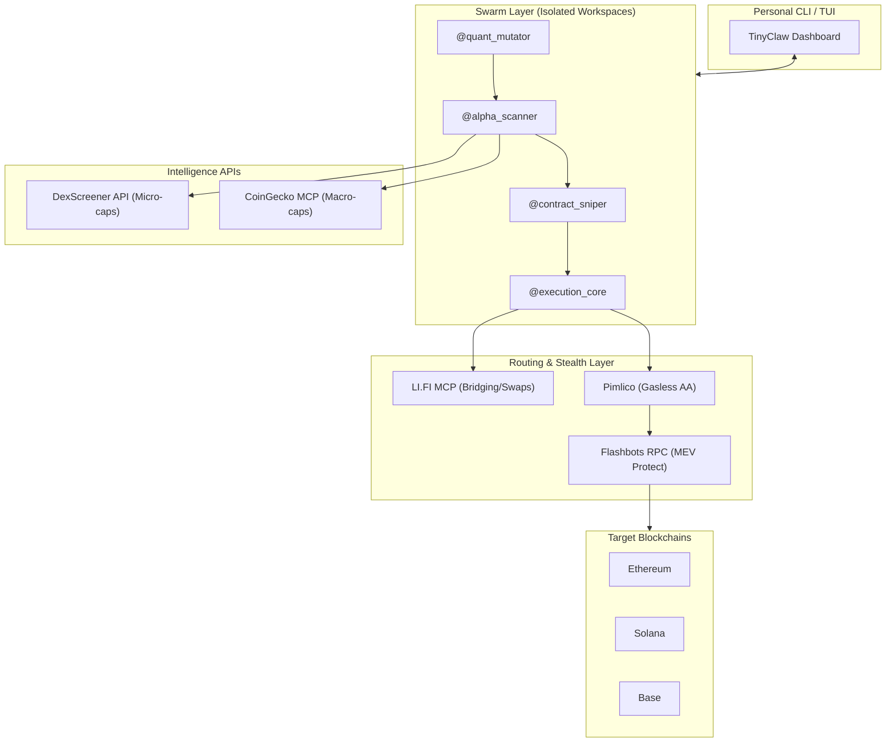
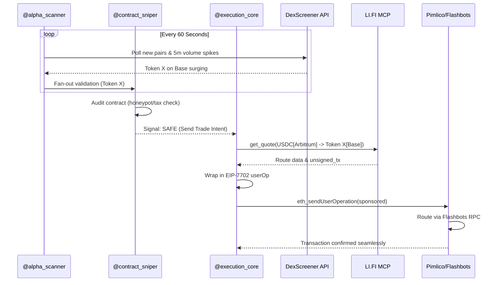
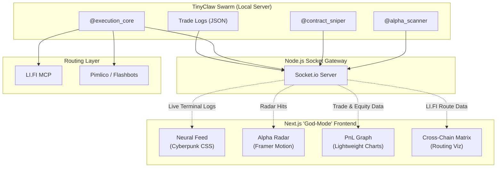

Here is the complete product and technical paper for a personal, highly aggressive, and unconstrained trading system designed purely for extracting maximum alpha without the overhead of retail UI, KYC, or market compliance features.

# 🚀 APEX-SWARM: Unconstrained Personal God-Mode Trading Matrix

## PART I: PRODUCT PAPER

### 1. Executive Summary

APEX-SWARM is a private, terminal-based AI trading swarm designed strictly for personal capital deployment across decentralized exchanges (DEXs). It utilizes an unconstrained multi-agent architecture to autonomously identify micro-cap token launches, bypass front-ends, and execute cross-chain trades in sub-seconds. The system operates outside of standard retail limitations, prioritizing raw execution speed, aggressive liquidity sniping, and zero-friction gasless routing.

### 2. Product Philosophy

The system is built on the philosophy of absolute automation and aggressive market extraction without human bottlenecks. It assumes maximum risk tolerance, focusing on finding volatile opportunities across 60+ blockchains and exploiting them instantly. Instead of conservative rebalancing, APEX-SWARM aims for high-frequency momentum trades, cross-chain arbitrage, and rapid strategy mutation when win rates drop.

### 3. Core Capabilities

- **Zero-Friction Liquidity:** The swarm uses LI.FI MCP to bridge and swap USDC from your main holding chain to any target chain dynamically in a single tool call. [docs.li](https://docs.li.fi/mcp-server/overview)
- **Dark Execution:** Transactions are routed through private RPC endpoints like Flashbots Protect to prevent MEV searchers from sandwich-attacking your highly aggressive trades. [quicknode](https://www.quicknode.com/builders-guide/tools/flashbots-protect-by-flashbots)
- **Gasless Speed:** Using EIP-7702 and the Pimlico Paymaster, the agents never need to fund gas wallets on new chains, eliminating dust and the delays of manual bridging. [docs.pimlico](https://docs.pimlico.io/guides/eip7702)
- **Deep Market Vision:** The agents bypass traditional market caps and monitor sub-minute liquidity pools directly via the DexScreener API and on-chain event listeners. [scribd](https://www.scribd.com/document/726735129/Reference-DEX-Screener-Docs)

---

## PART II: TECHNICAL PAPER

### 4. System Architecture

### 5. Open Source Building Blocks

The system is assembled using a highly modular stack of open-source frameworks and localized toolsets. It avoids heavy cloud infrastructure like Docker or Redis in favor of extreme local reliability.

| Module                  | Core Technology   | Role in APEX-SWARM                                                                                                                                                                              |
| :---------------------- | :---------------- | :---------------------------------------------------------------------------------------------------------------------------------------------------------------------------------------------- |
| **Agent Orchestration** | TinyClaw          | Manages parallel agents in isolated tmux workspaces without state corruption [linkedin](https://www.linkedin.com/posts/mohammadkshah_ai-aiagents-opensource-activity-7428691436705013760-1Q2R). |
| **Micro-Cap Data**      | DexScreener API   | Scans live pairs, 5-minute volume metrics, and new liquidity pools globally [pkg.go](https://pkg.go.dev/github.com/lajosdeme/dexscreener-api).                                                  |
| **Cross-Chain Routing** | LI.FI MCP         | Gives agents a direct tool to quote and construct bridging transactions [docs.li](https://docs.li.fi/mcp-server/overview).                                                                      |
| **Gasless Execution**   | Pimlico SDK       | Wraps standard transactions into ERC-4337 UserOps using EIP-7702 delegation [docs.pimlico](https://docs.pimlico.io/guides/eip7702/faqs).                                                        |
| **MEV Protection**      | Flashbots Protect | Conceals the system's aggressive transactions in a private mempool [quicknode](https://www.quicknode.com/builders-guide/tools/flashbots-protect-by-flashbots).                                  |

### 6. The Agent Roster

The swarm utilizes specialized agents running concurrently, passing data through a chain-execution and fan-out structure.

- **`@alpha_scanner`**: Continuously polls the DexScreener API for newly funded liquidity pools showing abnormal buyer counts and volume spikes within the last 5 minutes. [pkg.go](https://pkg.go.dev/github.com/lajosdeme/dexscreener-api)
- **`@contract_sniper`**: Instantly receives the token address, decompiles the contract, and checks for hardcoded honeypots, extreme tax structures, or mint authorities before giving a "go" signal.
- **`@execution_core`**: Queries the LI.FI MCP to find the fastest route for your stablecoins to the target asset, packages it via Pimlico for gasless execution, and broadcasts it to Flashbots. [eips.ethereum](https://eips.ethereum.org/EIPS/eip-7702)
- **`@quant_mutator`**: An offline GSD (Get-Shit-Done) loop that evaluates the hit rate of `@alpha_scanner`'s parameters daily, rewriting the Python logic if the strategy decays.

### 7. Core Execution Workflow

### 8. Step-by-Step Build Guide

**Phase 1: Local Setup and Data Ingestion**
Initialize a private server or high-performance local machine and install TinyClaw to set up your isolated agent workspaces. Write a Python script for `@alpha_scanner` to query the DexScreener API, focusing on parameters like `volume_5min` and `buyers_5min` to identify early momentum. [linkedin](https://www.linkedin.com/posts/mohammadkshah_ai-aiagents-opensource-activity-7428691436705013760-1Q2R)

**Phase 2: Execution Engine Integration**
Integrate the LI.FI MCP server into your local environment so your `@execution_core` agent can naturally call tools like `get_quote`. Create a single private key wallet and register it with Pimlico to enable EIP-7702 gas sponsorship via an API key, allowing the agent to execute without managing native tokens. [skywork](https://skywork.ai/skypage/en/li-fi-mcp-server-ai-cross-chain-defi/1981894449656074240)

**Phase 3: MEV Protection and Automation**
Update your execution scripts to point to the Flashbots Protect RPC endpoint rather than a public node to prevent your trades from being sandwiched. Finally, deploy the TUI dashboard provided by TinyClaw to monitor your swarm's live terminal outputs as they scan, audit, and trade completely autonomously. [jamesbachini](https://jamesbachini.com/flashbots-protect/)

Here is the updated paper with the **"God-Mode" High-Octane UI** integrated. This addition shifts the product from a blind terminal script to a cinematic, cyberpunk-inspired command center that visualizes the raw power and speed of your multi-agent swarm.

# 🚀 APEX-SWARM: God-Mode Trading Matrix

**Product & Technical Paper – UI Expansion (v1.1)**

---

## PART I: PRODUCT PAPER (UI Expansion)

### 1. The "Overwatch" Interface

While APEX-SWARM runs headless on a private server, the user interacts with it via the "Overwatch" Interface—a high-octane, browser-based command center. Moving away from standard SaaS dashboards, this UI is designed with a **Cyberpunk / God-Mode aesthetic**: pitch-black backgrounds, neon glowing accents (cyan, magenta, acid green), CRT flicker effects, and real-time streaming data that makes you feel like you are directly plugged into the crypto matrix.

### 2. Visual Modules

- **The Neural Feed (Live Swarm Logs):** A scrolling, matrix-style terminal feed on the left side of the screen. You watch in real-time as agents "think"—flashing messages like `[SYS] @alpha_scanner detected 400% volume spike on BASE` followed instantly by `[SEC] @contract_sniper DECOMPILING... NO HONEYPOT... GO`.
- **The Alpha Radar:** A 3D-styled scatter plot of the DexScreener anomaly landscape. Bubbles pulse and grow as tokens gain traction. When the swarm locks onto a target, a digital crosshair snaps onto the bubble.
- **Cross-Chain Routing Matrix:** An animated map visualizing LI.FI cross-chain swaps. When a bridging transaction fires, a glowing neon line shoots from your origin chain (e.g., Arbitrum) to the destination chain (e.g., Base), showing the exact route your capital is taking.
- **PnL Command Center:** A central, ultra-smooth TradingView candlestick chart overlaid with your buy/sell flags. Above it, a glowing equity curve shows your real-time total portfolio value updating tick-by-tick.

---

## PART II: TECHNICAL PAPER (UI Architecture)

### 3. Frontend Tech Stack

To achieve high-performance rendering and a "hacker" aesthetic without bogging down the browser, the frontend utilizes specific libraries: [dev](https://dev.to/sebyx07/introducing-cybercore-css-a-cyberpunk-design-framework-for-futuristic-uis-2e6c)

| Component                    | Technology                     | Purpose                                                                                                                                                                                                    |
| :--------------------------- | :----------------------------- | :--------------------------------------------------------------------------------------------------------------------------------------------------------------------------------------------------------- |
| **Framework**                | Next.js & React                | Core structure and fast component mounting.                                                                                                                                                                |
| **Styling & Cyberpunk Vibe** | TailwindCSS + CYBERCORE CSS    | Pure CSS styling for neon glows, CRT scanlines, and glitch effects without heavy JS overhead [dev](https://dev.to/sebyx07/introducing-cybercore-css-a-cyberpunk-design-framework-for-futuristic-uis-2e6c). |
| **Live Charts**              | TradingView Lightweight Charts | Native high-performance rendering of candlesticks and equity curves in React [tradingview.github](https://tradingview.github.io/lightweight-charts/tutorials/react/simple).                                |
| **Animations**               | Framer Motion                  | Smooth, high-octane transitions for UI elements and the cross-chain matrix lines.                                                                                                                          |
| **Data Streaming**           | Socket.io (WebSockets)         | Pipes the `stdout` from your TinyClaw tmux panes directly into the React UI for sub-second latency.                                                                                                        |

### 4. System Architecture (UI Integration)

### 5. Key UI Implementations

**5.1 Integrating Lightweight Charts for PnL**
To get that professional, high-octane financial look, we utilize TradingView's Lightweight Charts. It renders directly to an HTML canvas. You bind a React `useEffect` hook to your WebSocket stream so that every time `@execution_core` completes a trade, the new portfolio value is pushed to the `AreaSeries` chart, instantly updating the glowing neon equity curve. [tradingview.github](https://tradingview.github.io/lightweight-charts/tutorials/react/simple)

**5.2 The WebSocket Bridge to TinyClaw**
Since TinyClaw naturally runs your agents in isolated tmux sessions, you cannot natively view them in a browser. The solution is a lightweight Node.js wrapper:

1. Run a local Express + Socket.io server alongside TinyClaw.
2. Use Python's `tail -f` equivalent to read the output of each agent's local memory or `stdout`.
3. Broadcast this data via `socket.emit('agent_log', data)` directly to the Next.js frontend.

### 6. Build Guide for the UI

**Phase 1: Spin up Next.js & Sockets**
Initialize a new Next.js project. Set up a local Node.js WebSocket server that listens to the `.log` files generated by your TinyClaw agents. Confirm that when an agent outputs text on your backend, it instantly appears in the browser console.

**Phase 2: Cyberpunk Styling & The Neural Feed**
Install TailwindCSS and import cyberpunk-specific UI patterns (like `CYBERCORE CSS` for glowing borders and CRT filters). Create a `TerminalFeed` React component that receives the WebSocket text and applies a green/cyan text color on a black background. Auto-scroll this container to the bottom on every new message so it feels alive. [dev](https://dev.to/sebyx07/introducing-cybercore-css-a-cyberpunk-design-framework-for-futuristic-uis-2e6c)

**Phase 3: Charting the Alpha**
Install `lightweight-charts`. Create a main dashboard component that houses your PnL graph. Feed your total portfolio value into it. When `@alpha_scanner` finds a new pair, have the UI fetch the candlestick data from the DexScreener API and render it alongside the live agent feed, giving you absolute visual supremacy over the market before the trade executes. [tradingview.github](https://tradingview.github.io/lightweight-charts/tutorials/react/simple)
