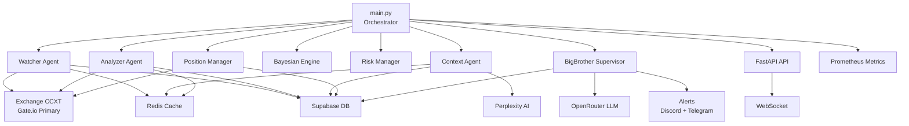

# Moonshot Trading Bot — Build Walkthrough

## What Was Built

24 files implementing a complete autonomous crypto trading bot with Gate.io as primary exchange.

### Architecture

### Trading Loop (8 Steps)

| Step | Component | Action |
|------|-----------|--------|
| 1 | **Watcher** | Scans 150+ USDT pairs, scores with 6 TA indicators, emits top 20 |
| 2 | **Analyzer** | Multi-TF analysis (5m/15m/1h/4h), detects 5 setup patterns |
| 3 | **Context** | Enriches with Perplexity AI market intelligence |
| 4 | **Bayesian** | Computes posterior probability, applies mode thresholds |
| 5 | **Risk** | Portfolio checks — Kelly sizing, exposure, drawdown limits |
| 6 | **Position** | Executes entries, manages 3-tier profit taking |
| 7 | **BigBrother** | Supervises mode, detects anomalies, fires alerts |
| 8 | **Broadcast** | WebSocket push to connected clients |

### Files Created

| Phase | Files | Key Highlights |
|-------|-------|----------------|
| **Phase 1** | 10 files | Config, logging, Redis, Prometheus, CCXT (Gate.io), Supabase, Perplexity, Watcher, Analyzer, Context |
| **Phase 2** | 4 files | Bayesian engine, Risk manager, Position manager, RL exit optimizer |
| **Phase 3** | 5 files | BigBrother, OpenRouter, Alerts, FastAPI+WS, Main orchestrator |
| **Support** | 5 files | [__init__.py](file:///Users/vishnuvardhanmedara/Moonshot-AutonomousAIMultiAgentCryptoBot/src/__init__.py), requirements.txt, docker-compose, Dockerfile, prometheus.yml |

## Verification Results

- ✅ **68 dependencies** installed successfully
- ✅ **All 19 modules** import without errors
- ✅ **Exchange map** confirmed: `gateio`, `binance`, `kucoin`
- ✅ **Docker stack** defined: bot + Redis + Prometheus + Grafana

## Next Steps

1. Populate [.env](file:///Users/vishnuvardhanmedara/Moonshot-AutonomousAIMultiAgentCryptoBot/.env) with real Gate.io API keys for live/paper trading
2. Run `docker-compose up` to spin up the full stack
3. Phase 4: unit tests, integration tests, paper trading validation
